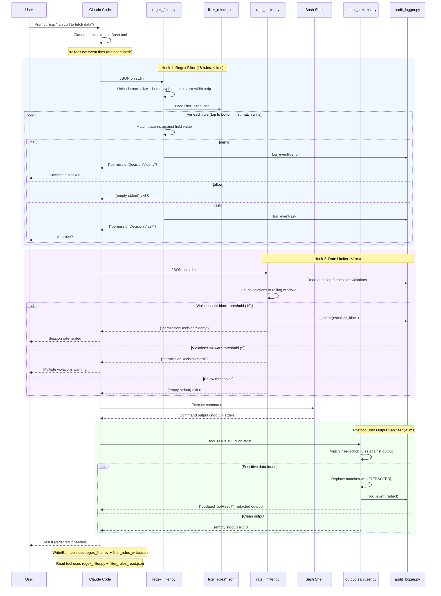
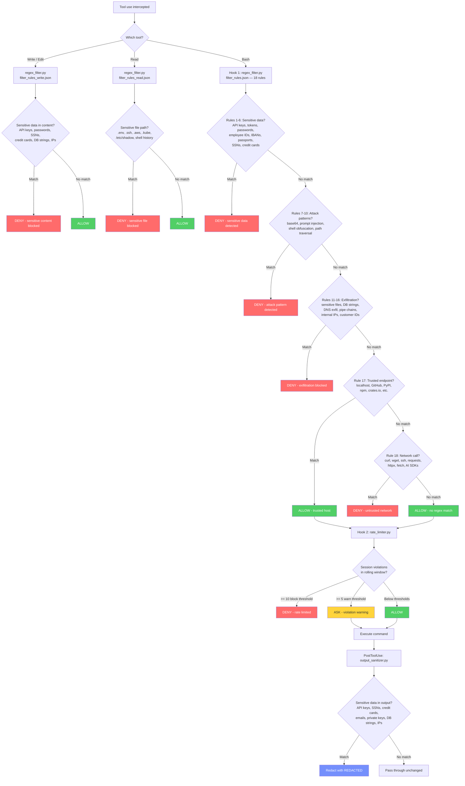

# Hook System — Diagrams

## Full Pipeline Sequence

## Decision Flow

> NLP plugin dispatch diagrams are available in [claude-privacy-hook-pro](https://github.com/anthropics/claude-privacy-hook-pro).
