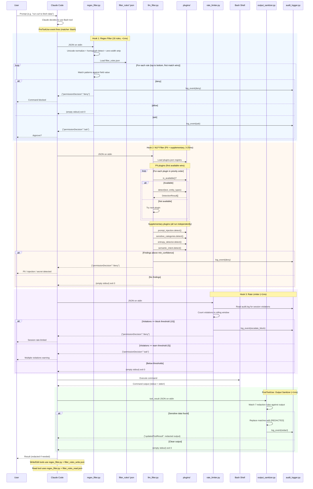
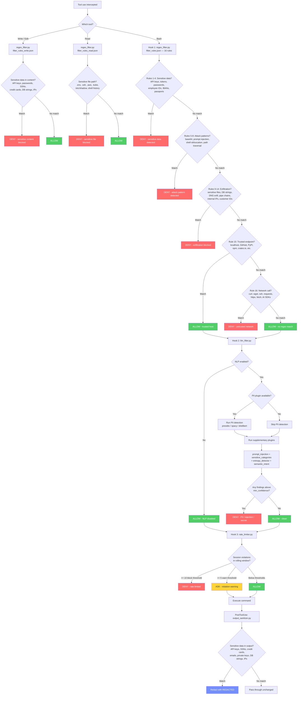
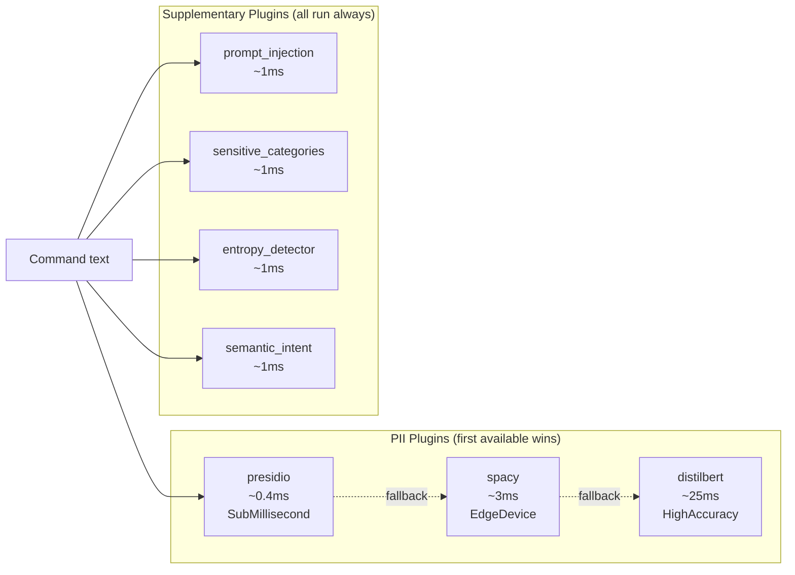

# Hook System — Diagrams

## Full Pipeline Sequence

```mermaid
sequenceDiagram
    participant User
    participant ClaudeCode as Claude Code
    participant Regex as regex_filter.py
    participant Rules as filter_rules*.json
    participant NLP as llm_filter.py
    participant Plugins as plugins/
    participant RateLim as rate_limiter.py
    participant Shell as Bash Shell
    participant Sanitizer as output_sanitizer.py
    participant Audit as audit_logger.py

    User->>ClaudeCode: Prompt (e.g. "run curl to fetch data")
    ClaudeCode->>ClaudeCode: Claude decides to use Bash tool

    Note over ClaudeCode: PreToolUse event fires (matcher: Bash)

    rect rgb(240, 248, 255)
        Note over Regex,Rules: Hook 1: Regex Filter (16 rules, <1ms)
        ClaudeCode->>Regex: JSON on stdin
        Regex->>Regex: Unicode normalize + homoglyph detect + zero-width strip
        Regex->>Rules: Load filter_rules.json

        loop For each rule (top to bottom, first match wins)
            Regex->>Regex: Match patterns against field value
            alt deny
                Regex->>Audit: log_event(deny)
                Regex-->>ClaudeCode: {"permissionDecision":"deny"}
                ClaudeCode-->>User: Command blocked
            else allow
                Regex-->>ClaudeCode: (empty stdout) exit 0
            else ask
                Regex->>Audit: log_event(ask)
                Regex-->>ClaudeCode: {"permissionDecision":"ask"}
                ClaudeCode-->>User: Approve?
            end
        end
    end

    rect rgb(255, 248, 240)
        Note over NLP,Plugins: Hook 2: NLP Filter (PII + supplementary, 3-25ms)
        ClaudeCode->>NLP: JSON on stdin
        NLP->>Plugins: Load plugins.json registry

        Note over NLP,Plugins: PII plugins (first available wins)
        loop For each plugin in priority order
            NLP->>Plugins: is_available()?
            alt Available
                NLP->>Plugins: detect(text, entity_types)
                Plugins-->>NLP: DetectionResult[]
            else Not available
                NLP->>NLP: Try next plugin
            end
        end

        Note over NLP,Plugins: Supplementary plugins (all run independently)
        NLP->>Plugins: prompt_injection.detect()
        NLP->>Plugins: sensitive_categories.detect()
        NLP->>Plugins: entropy_detector.detect()
        NLP->>Plugins: semantic_intent.detect()

        alt Findings above min_confidence
            NLP->>Audit: log_event(deny)
            NLP-->>ClaudeCode: {"permissionDecision":"deny"}
            ClaudeCode-->>User: PII / injection / secret detected
        else No findings
            NLP-->>ClaudeCode: (empty stdout) exit 0
        end
    end

    rect rgb(248, 240, 255)
        Note over RateLim,Audit: Hook 3: Rate Limiter (<1ms)
        ClaudeCode->>RateLim: JSON on stdin
        RateLim->>Audit: Read audit.log for session violations
        RateLim->>RateLim: Count violations in rolling window

        alt Violations >= block threshold (10)
            RateLim->>Audit: log_event(escalate_block)
            RateLim-->>ClaudeCode: {"permissionDecision":"deny"}
            ClaudeCode-->>User: Session rate-limited
        else Violations >= warn threshold (5)
            RateLim-->>ClaudeCode: {"permissionDecision":"ask"}
            ClaudeCode-->>User: Multiple violations warning
        else Below thresholds
            RateLim-->>ClaudeCode: (empty stdout) exit 0
        end
    end

    ClaudeCode->>Shell: Execute command
    Shell-->>ClaudeCode: Command output (stdout + stderr)

    rect rgb(240, 255, 240)
        Note over Sanitizer,Audit: PostToolUse: Output Sanitizer (<1ms)
        ClaudeCode->>Sanitizer: tool_result JSON on stdin
        Sanitizer->>Sanitizer: Match 7 redaction rules against output

        alt Sensitive data found
            Sanitizer->>Sanitizer: Replace matches with [REDACTED]
            Sanitizer->>Audit: log_event(redact)
            Sanitizer-->>ClaudeCode: {"updatedToolResult": redacted output}
        else Clean output
            Sanitizer-->>ClaudeCode: (empty stdout) exit 0
        end
    end

    ClaudeCode-->>User: Result (redacted if needed)

    Note over ClaudeCode: Write/Edit tools use regex_filter.py + filter_rules_write.json
    Note over ClaudeCode: Read tool uses regex_filter.py + filter_rules_read.json
```

## Decision Flow

```mermaid
flowchart TD
    A[Tool use intercepted] --> B{Which tool?}

    B -->|Bash| C[Hook 1: regex_filter.py<br/>filter_rules.json — 16 rules]
    B -->|Write / Edit| W[regex_filter.py<br/>filter_rules_write.json]
    B -->|Read| R[regex_filter.py<br/>filter_rules_read.json]

    W --> W1{Sensitive data in content?<br/>API keys, passwords, SSNs,<br/>credit cards, DB strings, IPs}
    W1 -->|Match| W2[DENY - sensitive content blocked]
    W1 -->|No match| W3[ALLOW]

    R --> R1{Sensitive file path?<br/>.env, .ssh, .aws, .kube,<br/>/etc/shadow, shell history}
    R1 -->|Match| R2[DENY - sensitive file blocked]
    R1 -->|No match| R3[ALLOW]

    C --> D{Rules 1-4: Sensitive data?<br/>API keys, tokens, passwords,<br/>employee IDs, IBANs, passports}
    D -->|Match| E[DENY - sensitive data detected]
    D -->|No match| F{Rules 5-8: Attack patterns?<br/>base64, prompt injection,<br/>shell obfuscation, path traversal}
    F -->|Match| F1[DENY - attack pattern detected]
    F -->|No match| G{Rules 9-14: Exfiltration?<br/>sensitive files, DB strings,<br/>DNS exfil, pipe chains,<br/>internal IPs, customer IDs}
    G -->|Match| G1[DENY - exfiltration blocked]
    G -->|No match| H{Rule 15: Trusted endpoint?<br/>localhost, GitHub, PyPI,<br/>npm, crates.io, etc.}
    H -->|Match| I[ALLOW - trusted host]
    H -->|No match| J{Rule 16: Network call?<br/>curl, wget, ssh, requests,<br/>httpx, fetch, AI SDKs}
    J -->|Match| K[DENY - untrusted network]
    J -->|No match| L[ALLOW - no regex match]

    I --> M[Hook 2: llm_filter.py]
    L --> M

    M --> M1{NLP enabled?}
    M1 -->|No| M2[ALLOW - NLP disabled]
    M1 -->|Yes| M3{PII plugin available?}
    M3 -->|Yes| M4[Run PII detection<br/>presidio / spacy / distilbert]
    M3 -->|No| M5[Skip PII detection]
    M4 --> M6[Run supplementary plugins]
    M5 --> M6
    M6 --> M7[prompt_injection + sensitive_categories<br/>+ entropy_detector + semantic_intent]
    M7 --> M8{Any findings above<br/>min_confidence?}
    M8 -->|Yes| M9[DENY - PII / injection / secret]
    M8 -->|No| M10[ALLOW - clean]

    M2 --> N[Hook 3: rate_limiter.py]
    M10 --> N
    N --> N1{Session violations<br/>in rolling window?}
    N1 -->|>= 10 block threshold| N2[DENY - rate limited]
    N1 -->|>= 5 warn threshold| N3[ASK - violation warning]
    N1 -->|Below thresholds| N4[ALLOW]

    N3 --> O[Execute command]
    N4 --> O
    O --> P[PostToolUse: output_sanitizer.py]
    P --> P1{Sensitive data in output?<br/>API keys, SSNs, credit cards,<br/>emails, private keys, DB strings, IPs}
    P1 -->|Match| P2[Redact with REDACTED]
    P1 -->|No match| P3[Pass through unchanged]

    style E fill:#ff6b6b,color:#fff
    style F1 fill:#ff6b6b,color:#fff
    style G1 fill:#ff6b6b,color:#fff
    style K fill:#ff6b6b,color:#fff
    style M9 fill:#ff6b6b,color:#fff
    style N2 fill:#ff6b6b,color:#fff
    style W2 fill:#ff6b6b,color:#fff
    style R2 fill:#ff6b6b,color:#fff

    style I fill:#51cf66,color:#fff
    style L fill:#51cf66,color:#fff
    style M2 fill:#51cf66,color:#fff
    style M10 fill:#51cf66,color:#fff
    style N4 fill:#51cf66,color:#fff
    style W3 fill:#51cf66,color:#fff
    style R3 fill:#51cf66,color:#fff

    style N3 fill:#ffd43b,color:#333
    style P2 fill:#748ffc,color:#fff
```

## NLP Plugin Dispatch

```mermaid
flowchart LR
    subgraph "PII Plugins (first available wins)"
        P1[presidio<br/>~0.4ms<br/>SubMillisecond]
        P2[spacy<br/>~3ms<br/>EdgeDevice]
        P3[distilbert<br/>~25ms<br/>HighAccuracy]
        P1 -.->|fallback| P2
        P2 -.->|fallback| P3
    end

    subgraph "Supplementary Plugins (all run always)"
        S1[prompt_injection<br/>~1ms]
        S2[sensitive_categories<br/>~1ms]
        S3[entropy_detector<br/>~1ms]
        S4[semantic_intent<br/>~1ms]
    end

    Input[Command text] --> P1
    Input --> S1
    Input --> S2
    Input --> S3
    Input --> S4
```
